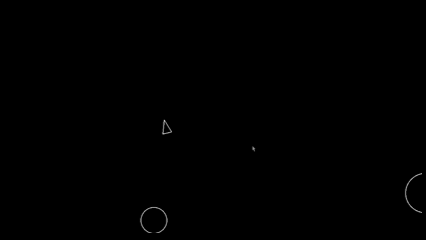

# Creating Asteroids using Pygame Library

## Overview
In this project, I wanted to try to recreate a basic version of the game "Asteroids" by using the Pygame python library. 

## Current Result


## How to Run the Game
1. Clone the repo
2. Create and activate a virtual environment
3. Run pip install -r requirements.txt
4. Run python3 main.py

## Project Summary
I started this project by creating a virtual environment and adding the Pygame library into it. This would allow me to import the library. From here I generated the game loop from the documentation found [here](https://www.pygame.org/docs/) using this code as a starting point:

```
# Example file showing a basic pygame "game loop"
import pygame

# pygame setup
pygame.init()
screen = pygame.display.set_mode((1280, 720))
clock = pygame.time.Clock()
running = True

while running:
    # poll for events
    # pygame.QUIT event means the user clicked X to close your window
    for event in pygame.event.get():
        if event.type == pygame.QUIT:
            running = False

    # fill the screen with a color to wipe away anything from last frame
    screen.fill("purple")

    # RENDER YOUR GAME HERE

    # flip() the display to put your work on screen
    pygame.display.flip()

    clock.tick(60)  # limits FPS to 60

pygame.quit()
```
From here, I created a constants.py that would hold all the constant values that would be regularly used within the game, and updated the code to reflect that. I then had to generate the sprites using the pygame.sprite.Sprite found [here](https://www.pygame.org/docs/ref/sprite.html#pygame.sprite.Sprite). As everything can be defined as a circle, I created the circleshape.py file which holds a CircleShape class. This class is designed so we can define the size and velocity of the circle, as well as provides functions to serve the object to the game state.

I then created the Player class which inherits from the CircleShape class to generate a player. This holds all of the functions necessary to handle player actions such as movement, shooting, etc.

I then created asteroid.py which serves as the basis for the asteroids within the game, and the asteroidfield.py which generates the asteroids from the edges of the map. I tied everything together in main.py by creating groups and containers to handle state.

## Potential Future Features
- Add score mechanism
- Add life mechanic
- Add power ups
- Add a Game Over and Retry Screen

## Final Thoughts
This was a good project to improve my Python skills and try something different.